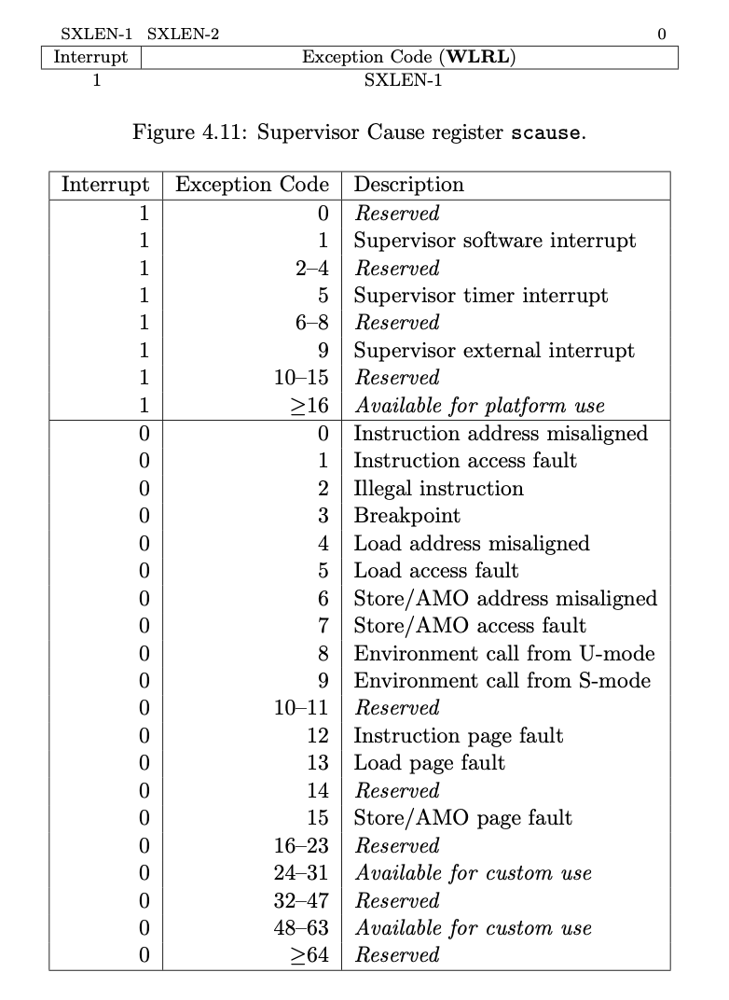

# RustOS-lab2

陈张萌 2017013678 计74

[TOC]

## 本次实验增加了什么

1. 
2. 

## 回答问题

### 问题1

正确进入 U 态后，程序的特征还应有：使用 S 态特权指令，访问 S 态寄存器后会报错。目前由于一些其他原因，这些问题不太好测试，请同学们可以自行测试这些内容（参考 [前三个测例](https://github.com/DeathWish5/rCore_tutorial_tests/tree/master/user/src/bin) )，描述程序出错行为，同时注意注明你使用的 sbi 及其版本。

### 问题2

请结合用例理解 [trap.S](https://github.com/rcore-os/rCore-Tutorial-v3/blob/ch2/os/src/trap/trap.S) 中两个函数 `__alltraps` 和 `__restore` 的作用，并回答如下几个问题:

1. L40: 刚进入 `__restore` 时，`a0` 代表了什么值。请指出 `__restore` 的两种使用情景。

2. L46-L51: 这几行汇编代码特殊处理了哪些寄存器？这些寄存器的的值对于进入用户态有何意义？请分别解释。

   ```
   ld t0, 32*8(sp)
   ld t1, 33*8(sp)
   ld t2, 2*8(sp)
   csrw sstatus, t0
   csrw sepc, t1
   csrw sscratch, t2
   ```

3. L53-L59: 为何跳过了 `x2` 和 `x4`？

   ```
   ld x1, 1*8(sp)
   ld x3, 3*8(sp)
   .set n, 5
   .rept 27
      LOAD_GP %n
      .set n, n+1
   .endr
   ```

4. L63: 该指令之后，`sp` 和 `sscratch` 中的值分别有什么意义？

   ```
   csrrw sp, sscratch, sp
   ```

1. `__restore`：中发生状态切换在哪一条指令？为何该指令执行之后会进入用户态？

2. L13： 该指令之后，`sp` 和 `sscratch` 中的值分别有什么意义？

   ```
   csrrw sp, sscratch, sp
   ```

3. 从 U 态进入 S 态是哪一条指令发生的？

### 问题3

> 描述程序陷入内核的两大原因是中断和异常，请问 riscv64 支持哪些中断／异常？如何判断进入内核是由于中断还是异常？描述陷入内核时的几个重要寄存器及其值。

riscv64将中断/异常类型保存在scause寄存器中，下表中展示了中断和异常的编号。判断中断/异常只需要看最高位是1（中断）还是0（异常）。



陷入内核时的重要寄存器：

| 寄存器   | 功能                                                         |
| -------- | ------------------------------------------------------------ |
| ssstatus | 保存中断/异常屏蔽位、返回后的特权级、中断模式（direct or vector）等信息 |
| scause   | 保存中断/异常编号                                            |
| sepc     | 记录发生中断前的指令的虚拟地址。                             |

（以上内容参考：The RISC-V Instruction Set Manual）

## 你对本次实验设计及难度/工作量的看法，以及有哪些需要改进的地方

我觉得难度比较合适。
