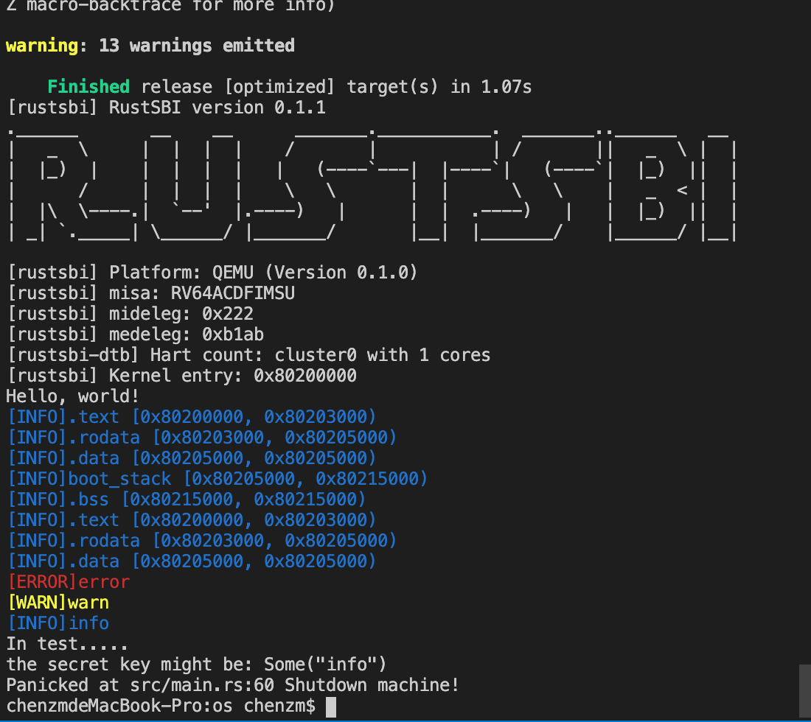
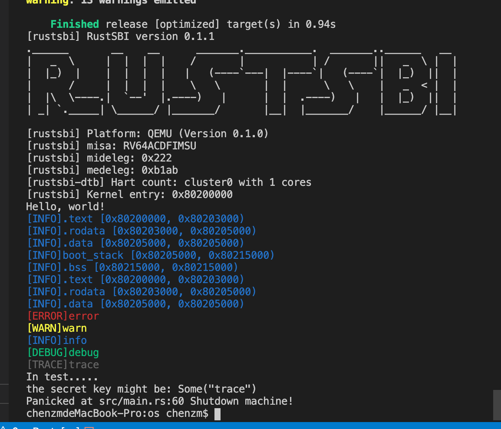

# RustOS-lab2

陈张萌 2017013678 计74

[TOC]

## 本次实验增加了什么

1. 

## 实验截图

` make run LOG=info`

`make run LOG=trace`

## 回答问题

### 为了方便 os 处理，Ｍ态软件会将 S 态异常/中断委托给 S 态软件，请指出有哪些寄存器记录了委托信息，rustsbi 委托了哪些异常/中断？（也可以直接给出寄存器的值）

### 请学习 gdb 调试工具的使用(这对后续调试很重要)，并通过 gdb 简单跟踪从机器加电到跳转到 0x80200000 的简单过程。只需要描述重要的跳转即可，只需要描述在 qemu 上的情况。

使用下面的指令对os.bin进行反汇编，发现os的地址是从0x80200000开始的。

`rust-objdump -S -d target/riscv64gc-unknown-none-elf/release/os > target/riscv64gc-unknown-none-elf/release/os.s  -x --arch-name=riscv64 `

## 你对本次实验设计及难度/工作量的看法，以及有哪些需要改进的地方

作为熟悉代码框架和熟悉Rust语言的第一个实验我觉得难度比较合适。

内容建议再改进一下，因为这次实验的内容即使完全不看指导书的任何内容，就对着println!宏魔改也能改出来，简而言之就是希望可以和代码框架关系更大一些的实验内容。