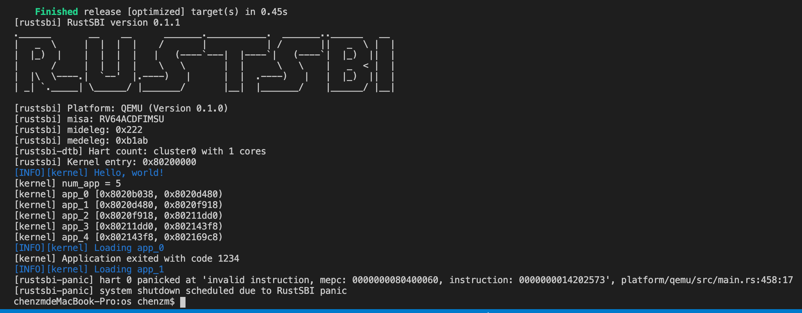

# RustOS-lab2

陈张萌 2017013678 计74

[TOC]

## 本次实验增加了什么

1. 在batch.rs文件中增加public函数，允许其他模块获得当前运行进程的地址空间(left,right)以及用户栈地址空间(left2,right2)
2. 在系统调用syswrite处进行检查，只有在以上两个空间范围内的内容允许输出。

## 回答问题

### 问题1

<<<<<<< HEAD
正确进入 U 态后，程序的特征还应有：使用 S 态特权指令，访问 S 态寄存器后会报错。目前由于一些其他原因，这些问题不太好测试，请同学们可以自行测试这些内容（参考 [前三个测例](https://github.com/DeathWish5/rCore_tutorial_tests/tree/master/user/src/bin) )，描述程序出错行为，同时注意注明你使用的 sbi 及其版本。

修改测试程序，在U态程序中加入访问S态寄存器的代码，运行得到以下报错信息。因为U态没有访问S态寄存器的权限，因此访问S态寄存器会引入StoreFault，就会跳转到异常处理中StoreFault的位置，结束这个task，运行下一个task。

```toml
[INFO][kernel] Loading app_1
Into Test store_fault, we will insert an invalid store operation...
Kernel should kill this application!
[kernel] PageFault in application, core dumped.
```
=======
> 正确进入 U 态后，程序的特征还应有：使用 S 态特权指令，访问 S 态寄存器后会报错。目前由于一些其他原因，这些问题不太好测试，请同学们可以自行测试这些内容（参考 [前三个测例](https://github.com/DeathWish5/rCore_tutorial_tests/tree/master/user/src/bin) )，描述程序出错行为，同时注意注明你使用的 sbi 及其版本。

修改测试程序，在U态程序中加入访问S态寄存器的代码，运行得到以下报错信息。因为U态没有访问S态寄存器的权限，因此访问S态寄存器会报ivalid instruction，从而产生rustssbi-panic，进而退出。



我使用的sbi是0.1.1版。
>>>>>>> ch2

### 问题2

请结合用例理解 [trap.S](https://github.com/rcore-os/rCore-Tutorial-v3/blob/ch2/os/src/trap/trap.S) 中两个函数 `__alltraps` 和 `__restore` 的作用，并回答如下几个问题:

#### 问题2.1

L40: 刚进入 `__restore` 时，`a0` 代表了什么值。请指出 `__restore` 的两种使用情景。

<<<<<<< HEAD
刚进入 `__restore` 时，`a0` 代表的是内核栈的栈顶地址。
=======
刚进入 `__restore` 时，`a0` 代表的是内核栈的栈顶地址。使用__restore的两个场景如下：
>>>>>>> ch2

- 场景1: 准备进入U态，运行用户程序
- 场景2: 中断/异常处理结束，要返回U态

#### 问题2.2

L46-L51: 这几行汇编代码特殊处理了哪些寄存器？这些寄存器的的值对于进入用户态有何意义？请分别解释。

把存储在栈上的sstatus、sepc和sscratch寄存器从栈上恢复出来。

sstatus表示了进入trap之前的特权级；sepc存储的是用户态进入trap之前的虚拟地址（目前还没有实现，所以大概是实际地址），sscratch寄存器存储的是用户栈栈顶。（接下来要让sp指向用户栈栈顶，sscratch指向内核栈栈顶）。

```
ld t0, 32*8(sp)
ld t1, 33*8(sp)
ld t2, 2*8(sp)
csrw sstatus, t0
csrw sepc, t1
csrw sscratch, t2
```

#### 问题2.3

L53-L59: 为何跳过了 `x2` 和 `x4`？

因为`x2`就是`sp`，`tp(x4)` 除非我们手动出于一些特殊用途使用它，否则一般也不会被用到，在进入中断的时候这些寄存器也没有存在内核栈里。

```
ld x1, 1*8(sp)
ld x3, 3*8(sp)
.set n, 5
.rept 27
   LOAD_GP %n
   .set n, n+1
.endr
```

#### 问题2.4

L63: 该指令之后，`sp` 和 `sscratch` 中的值分别有什么意义？

在这条指令之后，sp指向的是用户栈栈顶，sscratch指向内核栈栈顶。

```
csrrw sp, sscratch, sp
```

#### 问题2.5

` __restore`：中发生状态切换在哪一条指令？为何该指令执行之后会进入用户态？

状态发生切换在sret。CPU执行该指令会做：CPU从S-Mode变为U-Mode，pc指向sepc（也就是陷入内核前的指令地址），sp指向用户栈栈顶。

#### 问题2.6

从 U 态进入 S 态是哪一条指令发生的？

U态进入S态是在sbi.rs中调用sbi_call(xxx)时内联汇编代码的ecall指令会使程序由U态进入S态。

### 问题3

> 描述程序陷入内核的两大原因是中断和异常，请问 riscv64 支持哪些中断／异常？如何判断进入内核是由于中断还是异常？描述陷入内核时的几个重要寄存器及其值。

riscv64将中断/异常类型保存在scause寄存器中，下表中展示了中断和异常的编号。判断中断/异常只需要看最高位是1（中断）还是0（异常）。


陷入内核时的重要寄存器：

| 寄存器   | 功能                                                         |
| -------- | ------------------------------------------------------------ |
| ssstatus | 保存中断/异常屏蔽位、返回后的特权级、中断模式（direct or vector）等信息 |
| scause   | 保存中断/异常编号                                            |
| sepc     | 记录发生中断前的指令的虚拟地址                               |
| sscratch | 陷入内核前保存的是内核栈地址，陷入内核后保存用户栈地址       |

（以上内容参考：The RISC-V Instruction Set Manual）

<<<<<<< HEAD
=======
### 问题4

>对于任何中断， __alltraps 中都需要保存所有寄存器吗？你有没有想到一些加速 __alltraps 的方法？简单描述你的想法。

一般还是需要保存寄存器的，因为中断&&异常有可能发生在任何地方，所以需要确保上下文的一致性。

加速的方法有是有，但是感觉总体上还是得不偿失。比如说，可以修改CPU架构，为ecall设计特殊的上下文切换指令和寄存器，或者约定调用ecall只保存某些特定寄存器。但是问题在于多保存几个寄存器并不会有多么明显的性能损失，但是这些优化却会破坏安全性，而且这样的CPU和OS看起来一点都不优美。

>>>>>>> ch2
## 你对本次实验设计及难度/工作量的看法，以及有哪些需要改进的地方

我觉得难度比较合适。
