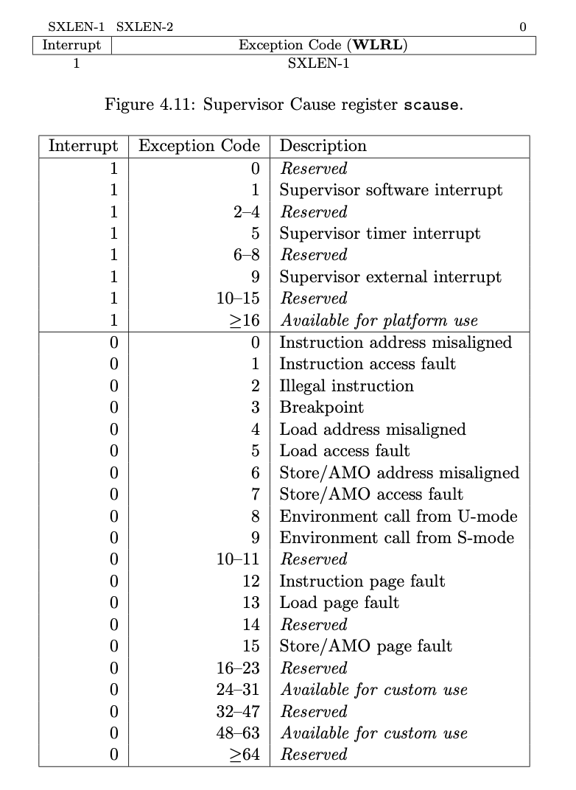

# RustOS-lab4 实验报告

陈张萌 2017013678 计74

[TOC]

## 本次实验增加了什么？

1. 增加了物理内存动态分配。在OS启动时对物理内存分配器进行初始化，使得OS中的物理内存分配机制使用我们提供的stack分配策略。
2. 增加了分页机制，为每个进程提供虚拟地址空间和页表，为每个物理地址建立到自己的一一映射以便OS在开启分页后仍然能方便地访问物理地址。
3. 增加了mmap和munmap系统调用。事实上只要调用代码框架中已经写好的函数就可以了，需要自己完成的函数是对map/unmap的失败情况进行检查。

## 简答作业

### 问题1、页表项

> 请列举 SV39 页表页表项的组成，结合课堂内容，描述其中的标志位有何作用／潜在作用？

页表项的高44位表示ppn，即物理页号；页表项的低8位是标志位：V（表示次页表有效）,R（可读）,W（可写）,X（可执行）,U（用户态可访问）,GAD本次实验没有用到。

利用标志位，可以和CPU协同工作，提供访问权限控制、地址保护等功能。例如当一个页在U态可访问时可以将标志位U置为1，这样CPU在执行时就知道如果一个用户程序的虚拟地址对应的页表标志位为U，因此就可以允许其进行地址转换，进而允许访问。

还可以帮助OS进行修改页表的工作。例如在进行map时，可以用虚拟地址找到对应的页表项并检查valid位，据此判断这是新分配的页表项还是已经map过的页表项。

### 问题2、缺页

> 缺页指的是进程访问页面时页面不在页表中或在页表中无效的现象，此时 MMU 将会返回一个中断，告知 os 进程内存访问出了问题。os 选择填补页表并重新执行异常指令或者杀死进程。

#### (2-1-1) 请问哪些异常可能是缺页导致的？



RISC-V中的异常种类如上表所示。其中，有可能由于缺页产生的异常类型是：

- 12，13，15三种类型的pagefault

#### (2-1-2)发生缺页时，描述相关的重要寄存器的值（lab2中描述过的可以简单点）

陷入内核时的重要寄存器：

| 寄存器   | 功能                                                         |
| -------- | ------------------------------------------------------------ |
| ssstatus | 保存中断/异常屏蔽位、返回后的特权级、中断模式（direct or vector）等信息 |
| scause   | 保存中断/异常编号，产生page fault时，scause为12、13或15      |
| sepc     | 记录发生中断前的指令的虚拟地址                               |
| sscratch | 陷入内核前保存的是内核栈地址，陷入内核后保存用户栈地址       |

（以上内容参考：The RISC-V Instruction Set Manual）


> 缺页有两个常见的原因，其一是 Lazy 策略，也就是直到内存页面被访问才实际进行页表操作。比如，一个程序被执行时，进程的代码段理论上需要从磁盘加载到内存。但是 os 并不会马上这样做，而是会保存 .text 段在磁盘的位置信息，在这些代码第一次被执行时才完成从磁盘的加载操作。

#### (2-2)这样做有哪些好处？

这样做可以节省开销。例如一个极端情况是，一个程序写了长达几个G的代码，但是在main函数却里面直接return 0，如果把整个函数都一次性加载进内存中，开销太大了。

> 此外 COW(Copy On Write) 也是常见的容易导致缺页的 Lazy 策略，这个之后再说。其实，我们的 mmap 也可以采取 Lazy 策略，比如：一个用户进程先后申请了 10G 的内存空间，然后用了其中 1M 就直接退出了。按照现在的做法，我们显然亏大了，进行了很多没有意义的页表操作。

#### (2-3-1)请问处理 10G 连续的内存页面，需要操作的页表实际大致占用多少内存(给出数量级即可)？

按照实验所用的页表进行估计，每一页有4096Byte，也即每一页的大小是4KByte。$10GByte=10 * 2^{10}MByte=10 * 2^{20}KByte=2.5 * 2^{20}$条页表。每条页表占据8Byte，总共占用空间为$8*2.5*2^{20}=20MByte$。

#### (2-3-2)请简单思考如何才能在现有框架基础上实现 Lazy 策略，缺页时又如何处理？描述合理即可，不需要考虑实现。

现有框架将find_pte_create函数放在MapArea的map函数里面进行调用，缺页时直接退出正在运行的用户进程，或者panic退出。

如果使用lazy策略，可以将find_pte_create函数放在缺页处理函数里面，当缺页时先寻找/创建pte，如果是可用的pte则可以继续执行；否则说明的确产生了非法访问，会退出正在运行的用户进程。

> 缺页的另一个常见原因是 swap 策略，也就是内存页面可能被换到磁盘上了，导致对应页面失效。

#### (2-4)此时页面失效如何表现在页表项(PTE)上？

在swap使得页面失效之后，PTE会将Valid位置1。

### 问题3、双页表与单页表

> 为了防范侧信道攻击，我们的 os 使用了双页表。但是传统的设计一直是单页表的，也就是说，用户线程和对应的内核线程共用同一张页表，只不过内核对应的地址只允许在内核态访问。

#### 1.如何更换页表？

对CPU来说，进行虚拟地址到实际地址之间的转换都是从satp寄存器取出第一级页表的地址，再据此访问二、三级页表。因此更换页表只需要把新页表的地址写入satp寄存器即可。

#### 2.单页表情况下，如何控制用户态无法访问内核页面？

页表项中有U位表示是否允许用户态访问，只需要将U位置0。

#### 3. 单页表有何优势？（回答合理即可）

单页表最大的优势就是节省更换页表的开销。在更换页表时，需要使用sfence指令提醒CPU，之前在CPU内缓存的页表项都失效了。读取新的页表就要再次放存，以sv39为例，一个没有缓存过的页表项需要访存4次，开销非常大，而频繁更换页表就会极大地增加放存次数，影响性能。

#### 4. 双页表实现下，何时需要更换页表？假设你写一个单页表操作系统，你会选择何时更换页表（回答合理即可）？

在执行用户程序时要使用用户态的页表，执行内核程序时要使用内核的页表。因此，进入trap的时候要把页表更换成kernel的页表，trap处理完毕返回时要更换成用户态页表。分别在代码中对应：

```rust
//为每个app都保存了kernel使用的页表，并且在进入trap的时候更新页表
impl TrapContext {
    pub fn set_sp(&mut self, sp: usize) { self.x[2] = sp; }
    pub fn app_init_context(
        entry: usize,
        sp: usize,
        kernel_satp: usize,
        kernel_sp: usize,
        trap_handler: usize,
    ) -> Self {
        let mut sstatus = sstatus::read();
        sstatus.set_spp(SPP::User);
        let mut cx = Self {
            x: [0; 32],
            sstatus,
            sepc: entry,
            kernel_satp,
          //就保存在这里，为每一个进程都保存了一份
            kernel_sp,
            trap_handler,
        };
        cx.set_sp(sp);
        cx
    }
}
```

```rust
//trap执行完毕返回用户态时
#[no_mangle]
pub fn trap_return() -> ! {
    set_user_trap_entry();
    let trap_cx_ptr = TRAP_CONTEXT;
    let user_satp = current_user_token();
    extern "C" {
        fn __alltraps();
        fn __restore();
    }
    let restore_va = __restore as usize - __alltraps as usize + TRAMPOLINE;
    unsafe {
        llvm_asm!("fence.i" :::: "volatile");
        llvm_asm!("jr $0" :: "r"(restore_va), "{a0}"(trap_cx_ptr), "{a1}"(user_satp) :: "volatile");
    }
  //trap执行完毕，返回用户态，更换页表，并且刷新TLB
    panic!("Unreachable in back_to_user!");
}
```

单页表操作系统似乎不需要更换页表，只要在修改页表的时候提醒CPU之前缓存的TLB可能失效。

## 你对本次实验设计及难度/工作量的看法，以及有哪些需要改进的地方

我觉得这部分还有一些可以改进的地方。

第一是可以参考去年实验，物理内存动态分配、虚拟地址1、虚拟地址2一共分了3次实验进行。这部分相对来说是不太容易理解的知识点，所以多做几次实验总是好的。今年一次性搞定感觉确实需要多点时间消化～

第二是，实验内容还有改进空间。就是如果自己写的话，代码量比较少，几乎唯一做的事情就是调用了各种各样的函数，做完感觉像什么都没干一样。我觉得可以改成增加一些更加核心的功能的代码似乎会更好一些。