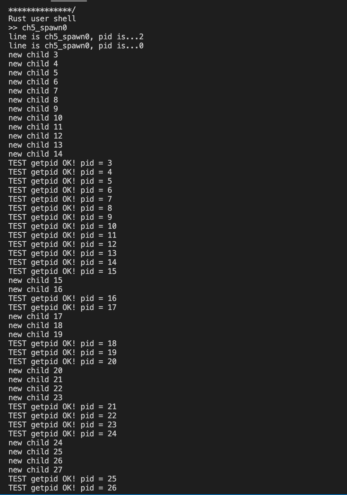
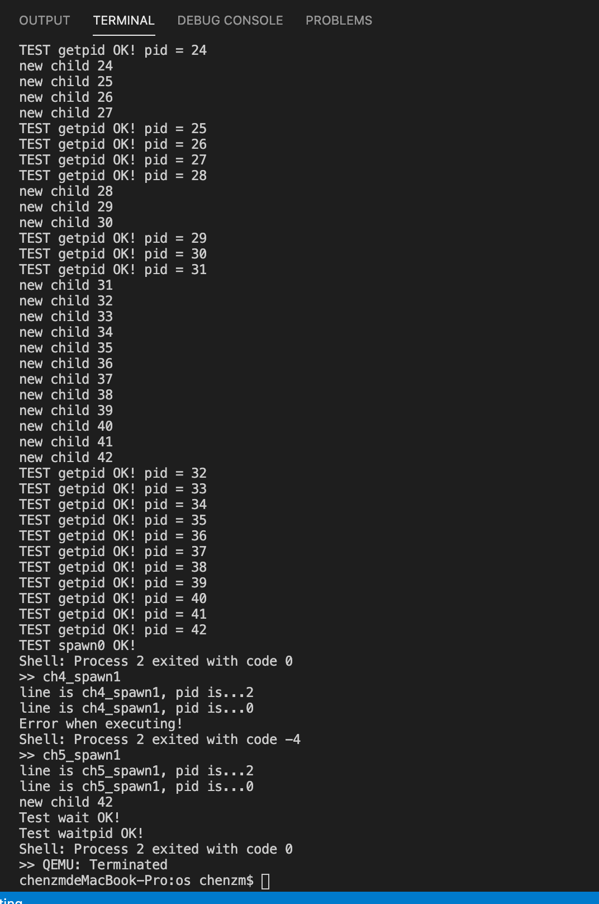

# RustOS-lab5 实验报告

陈张萌 2017013678 计74

[TOC]

## 本次实验增加了什么？

1. spawn系统调用。和新建一个进程控制块几乎一样，唯一的区别在于新建时需要：
   1. 使用类似exec系统调用的方式，从文件中将memory_set等加载进来
   2. 新建的进程和当前进程之间建立父子关系
   3. 新建进程加入到调度队列中

运行测例，输出结果如下：





## 简答作业

### 问题1

> fork + exec 的一个比较大的问题是 fork 之后的内存页/文件等资源完全没有使用就废弃了，针对这一点，有什么改进策略？

改进策略就是增加了spawn系统调用，新建一个进程控制块时就直接使用文件对memory_set进行初始化。

### 问题2

> 其实使用了题(1)的策略之后，fork + exec 所带来的无效资源的问题已经基本被解决了，但是今年来 fork 还是在被不断的批判，那么到底是什么正在”杀死”fork？可以参考 [论文](https://www.microsoft.com/en-us/research/uploads/prod/2019/04/fork-hotos19.pdf) ，**注意**：回答无明显错误就给满分，出这题只是想引发大家的思考，完全不要求看论文，球球了，别卷了。

- 非线程安全。例如某一个进程正在进行地址映射，因此拿着heap的锁，此时另一个进程在执行fork操作。此时如果在子进程中分配内存，就会出现死锁。
- 效率不高，例如问题1中说到的问题。
- 还会存在不安全的问题，

### 问题3

> fork 当年被设计并称道肯定是有其好处的。请使用 **带初始参数** 的 spawn 重写如下 fork 程序，然后描述 fork 有那些好处。注意:使用”伪代码”传达意思即可，spawn 接口可以自定义。可以写多个文件。

如果直接使用已经实现的spawn替换原来代码中的fork，会遇到这些问题：

- 需要在写代码的时候就知道自己的文件名是什么，不够灵活
- spawn目前只支持从文件新建进程控制块，新建出来的进程控制块会从头开始执行。也就是说，新建进程这件事会进入一个死循环，不断地新建子进程。

改写思路为：

- 思路1:为spawn增加默认构造选项，如果输入字符串为空则使用和将父程序的进程控制块复制一份给子程序，且执行状态也保持一致，返回值为-2。这种修改方式实际上实现的功能和fork是一样的了。
- 思路2:将if里面的函数内容封装到另一个文件中，使用spawn执行。

fork的好处就是新建出来的进程连执行状态也是和父进程一样的。

### 问题4

>描述进程执行的几种状态，以及 fork/exec/wait/exit 对于状态的影响。

```rust
pub enum TaskStatus {
    Ready,//表示进程准备就绪，受到调度就可以执行
    Running,//表示这是正在执行的进程
    Zombie,//进程已经执行完毕，等待回收资源
}
```

fork：将当前进程复制一份，新的进程状态为Ready，不改变当前进程执行状态

exec：不改变当前进程的执行状态，但是使用其他的文件来更新当前进程的memory_set等资源

wait：将当前正在Running的进程变为Ready

exit：将当前正在Running的进程改变为Zombie

## 你对本次实验设计及难度/工作量的看法，以及有哪些需要改进的地方

我觉得这次实验代码有些过于简单，只要看懂了指导书就实在是简单得令人发指。
