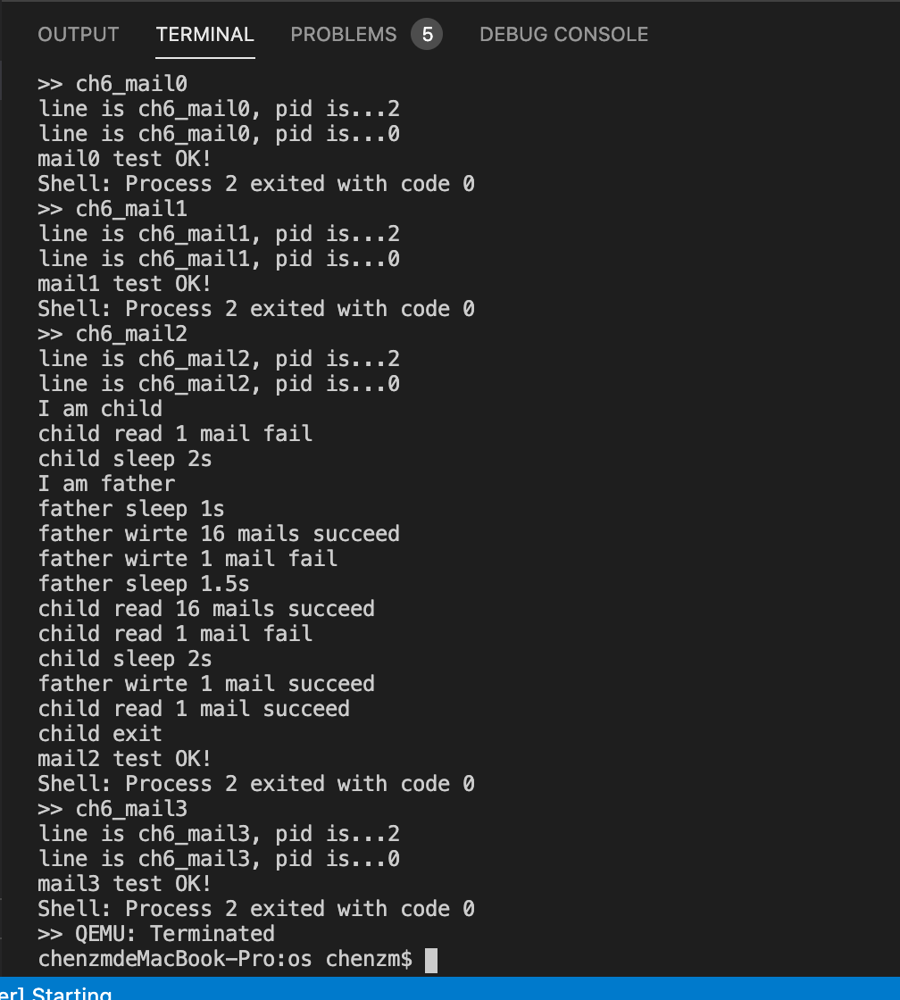

# RustOS-lab6 实验报告

陈张萌 2017013678 计74

[TOC]

## 本次实验增加了什么？

1. 

   

运行测例，输出结果如下：



## 简答作业

### 问题1

> 举出使用 pipe 的一个实际应用的例子。

例如：

```shell
ls -a | grep qemu
```

### 问题2

> 假设我们的邮箱现在有了更加强大的功能，容量大幅增加而且记录邮件来源，可以实现“回信”。考虑一个多核场景，有 m 个核为消费者，n 个为生产者，消费者通过邮箱向生产者提出订单，生产者通过邮箱回信给出产品。

#### 2-1

> 假设你的邮箱实现没有使用锁等机制进行保护，在多核情景下可能会发生哪些问题？单核一定不会发生问题吗？为什么？

多核情况下

单核情况下也可能发生问题。比如说

#### 2-2

>请结合你在课堂上学到的内容，描述读者写者问题的经典解决方案，必要时提供伪代码。

#### 2-3

> 由于读写是基于报文的，不是随机读写，你有什么点子来优化邮箱的实现吗？


### 问题3

> fork 当年被设计并称道肯定是有其好处的。请使用 **带初始参数** 的 spawn 重写如下 fork 程序，然后描述 fork 有那些好处。注意:使用”伪代码”传达意思即可，spawn 接口可以自定义。可以写多个文件。


如果直接使用已经实现的spawn替换原来代码中的fork，会遇到这些问题：

- 需要在写代码的时候就知道自己的文件名是什么，不够灵活
- spawn目前只支持从文件新建进程控制块，新建出来的进程控制块会从头开始执行。也就是说，新建进程这件事会进入一个死循环，不断地新建子进程。

改写思路为：

- 思路1:为spawn增加默认构造选项，如果输入字符串为空则使用和将父程序的进程控制块复制一份给子程序，且执行状态也保持一致，返回值为-2。这种修改方式实际上实现的功能和fork是一样的了。
- 思路2:将if里面的函数内容封装到另一个文件中，使用spawn执行。

fork的好处就是新建出来的进程连执行状态也是和父进程一样的。

### 问题4

>描述进程执行的几种状态，以及 fork/exec/wait/exit 对于状态的影响。

```rust
pub enum TaskStatus {
    Ready,//表示进程准备就绪，受到调度就可以执行
    Running,//表示这是正在执行的进程
    Zombie,//进程已经执行完毕，等待回收资源
}
```

fork：将当前进程复制一份，新的进程状态为Ready，不改变当前进程执行状态

exec：不改变当前进程的执行状态，但是使用其他的文件来更新当前进程的memory_set等资源

wait：将当前正在Running的进程变为Ready

exit：将当前正在Running的进程改变为Zombie

## 你对本次实验设计及难度/工作量的看法，以及有哪些需要改进的地方

我觉得这次实验代码有些过于简单，只要看懂了指导书就实在是简单得令人发指。