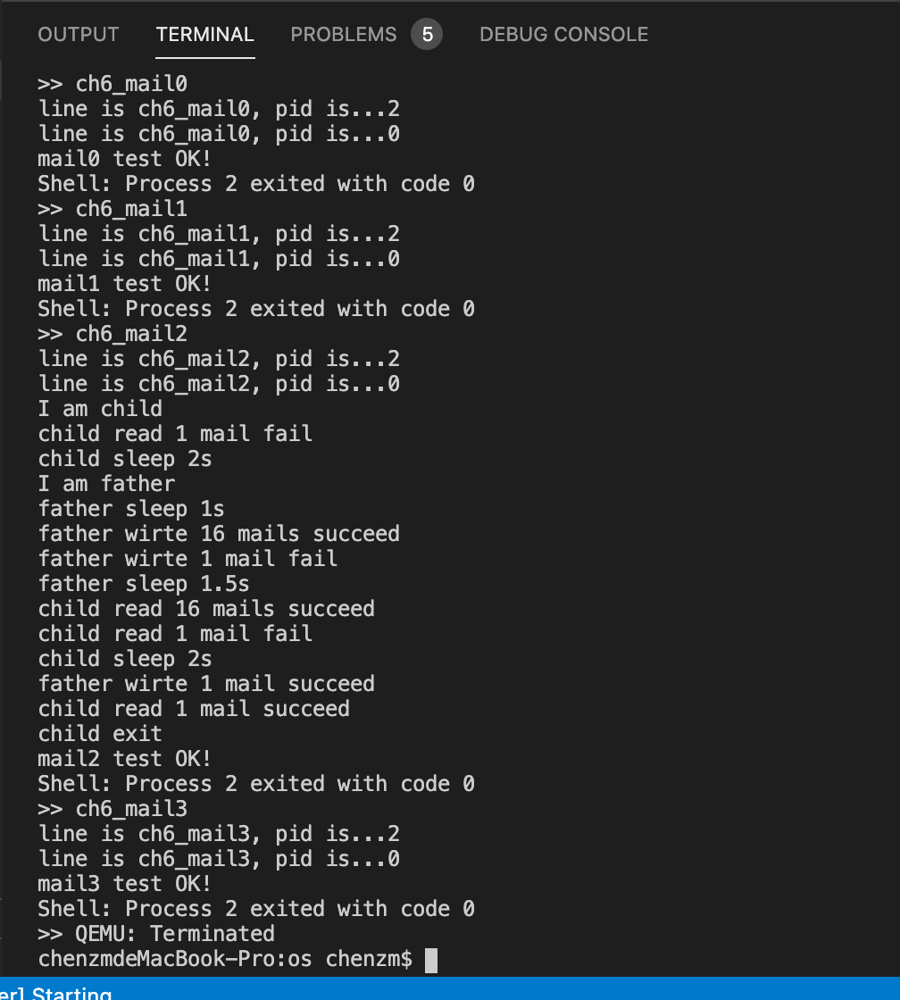
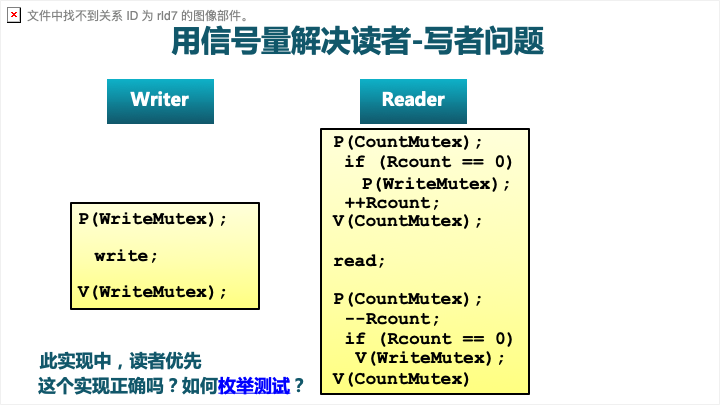
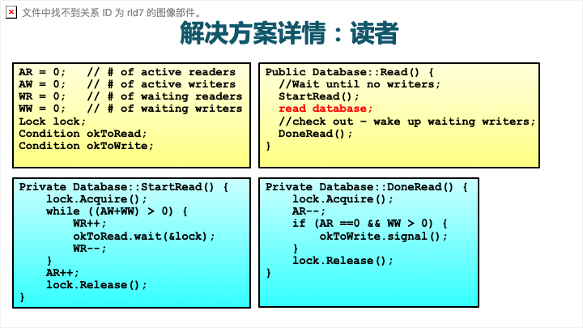
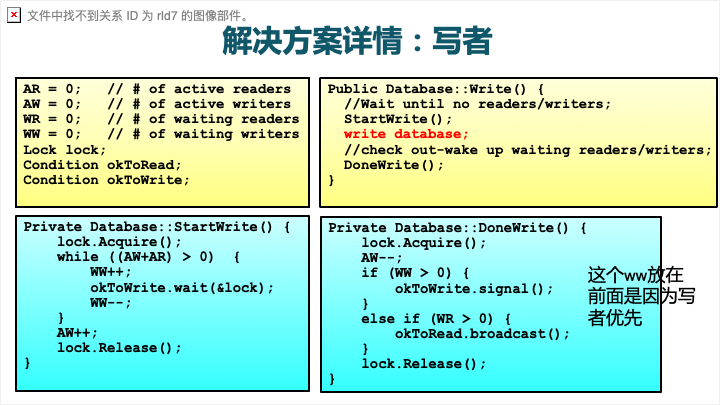

# RustOS-lab7 实验报告

陈张萌 2017013678 计74

[TOC]

## 本次实验增加了什么？

1. 模仿Pipe，增加了用于存储mail的文件格式：MPipe。每条MPipe和Pipe的区别在于：
   1. 增大了buffer的大小
   2. 在pipe中，如果pipe已经满了，那么就切换进程，但是在mpipe中如果满了，那就放弃写操作，返回写邮件失败
2. 每个Mail类存储的是新建的MPipe如果分配文件描述符成功，那么存储读邮件的文件描述符。写文件的描述符不需要存储，因为每条邮件只写一次，写完之后直接关闭写端即可。
3. 每个进程控制块分配一个mailbox，每个mailbox实现为一个FIFO的mail队列，记录了读邮件的文件描述符都有哪些。邮箱是否满、是否空都由mailbox确定。
4. 系统调用实现如下（mail_write为例，错误处理过于繁琐，不在此描述）：
   1. 新建一个MPipe，返回读端和写端
   2. 目标进程分配一个文件描述符，保存读端
   3. 当前进程分配一个文件描述符，保存写端
   4. 执行sys_write系统调用
   5. 执行sys_close关闭写端

运行测例，输出结果如下：



## 简答作业

### 问题1

> 举出使用 pipe 的一个实际应用的例子。

例如：

```shell
ls -a | grep qemu
```

### 问题2

> 假设我们的邮箱现在有了更加强大的功能，容量大幅增加而且记录邮件来源，可以实现“回信”。考虑一个多核场景，有 m 个核为消费者，n 个为生产者，消费者通过邮箱向生产者提出订单，生产者通过邮箱回信给出产品。

#### 2-1

> 假设你的邮箱实现没有使用锁等机制进行保护，在多核情景下可能会发生哪些问题？单核一定不会发生问题吗？为什么？

多核情况下，假设某个生产者邮箱只有一个空位，有多个消费者同时向那个生产者发邮件。消费者检查邮箱的时候发现都没有满，但是发送邮件后试图保存就会产生冲突。

单核情况下也可能发生一致性的问题。例如，对邮箱的写操作可能写到一半，还没写完，就发生进程切换，邮件就被读了。这样读到的内容不对，而且继续写也会发生问题。

#### 2-2

>请结合你在课堂上学到的内容，描述读者写者问题的经典解决方案，必要时提供伪代码。

读者写者问题可以使用信号量和管程进行解决。

##### 信号量

以读者优先为例。信号量机制定义了：

- WriteMutex：控制读写操作的互斥，1:现在正在执行读操作，0:正在执行写操作
- rcounter：正在执行读操作的读者数目，初始化为0
- CountMutex：控制对rcounter的互斥修改

对于写者，只要在写的时候判断是否能拿到写状态锁，执行写后释放；对于读者，如果当前发现还有读者想要读，那么就不释放锁；相应的如果发现已经有读者在读了，就说明已经拿到读锁了。通过这样的策略来实现读优先。



##### 管程

管程解决的问题是上面的策略可能导致hungry，因此想要发明一种方式来保证公平性。（这里采用PPT上的例子，写者优先）





#### 2-3

> 由于读写是基于报文的，不是随机读写，你有什么点子来优化邮箱的实现吗？

一个可能的想法是将每个邮箱再次进行拆分，拆成k个循环队列。每一个写者只能向自己的pid%k这个队列里写入邮件，简单说就是做一下hash。当然这种实现可能会产生新的问题，比如说这k个队列并不是全部满了，但是某一个进程有大量邮件要发，就会导致总体队列不满但是无法接收邮件。

为了解决这个问题或许可以考虑引进多处理器调度算法，但是对于内核来说得到的收益可能会比算法开销还要小。

以上内容和@杨雅儒同学进行了交流。

## 你对本次实验设计及难度/工作量的看法，以及有哪些需要改进的地方

我觉得挺好的。只不过我的实现效率有点低，不知道助教本来想让我们用什么方式实现呢？
