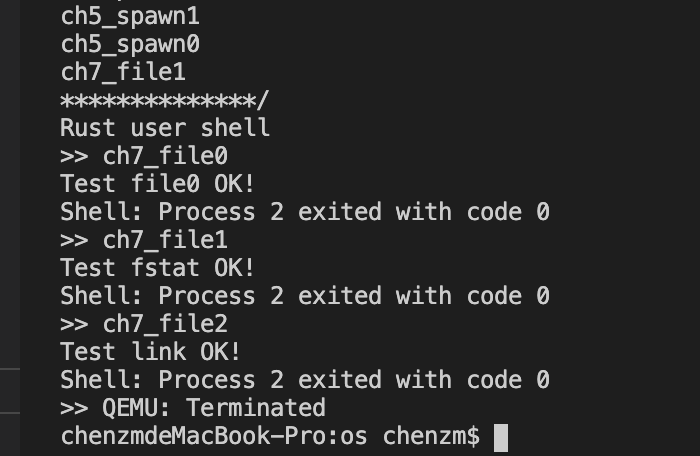

# RustOS-lab7 实验报告

陈张萌 2017013678 计74

[TOC]

## 本次实验增加了什么？

1. 修改文件系统
   1. create_linker：只允许根目录进行调用。先在根目录下新建一个DirEntry，找到旧文件的inode-id，将这个inode-id存进新建的DirEntry里面
   2. delete_linker：只允许根目录调用。在根目录下查找文件名相同的DirEntry，然后将其删除。因为测例里面没有直接通过这个系统调用删除文件的情况，所以暂且不进行处理。
   3. find_inode_id：通过文件名查找对应的id，也只允许根目录调用。
2. 修改OS
   1. 将以上内容抽象成os可用的接口，再写系统调用即可
3. 修改syscall
   1. 由于sys_linkat系统调用会传入5个参数，格式和其他系统调用不同，所以修改一下trap_handler处对系统调用的处理

运行测例，输出结果如下：



## 简答作业

### 问题1

> 目前的文件系统只有单级目录，假设想要支持多级文件目录，请描述你设想的实现方式，描述合理即可。

需要增加以下几个功能：

- 创建目录：和目前的创建文件功能相比几乎没有区别，也是：判断当前是目录，新建类型为目录的inode，新建DirEntry并保存inode-id
- 删除目录：同理，不过需要先递归删除本目录下所有目录和文件

### 问题2

> 在有了多级目录之后，我们就也可以为一个目录增加硬链接了。在这种情况下，文件树中是否可能出现环路？你认为应该如何解决？请在你喜欢的系统上实现一个环路，描述你的实现方式以及系统提示、实际测试结果。

是可能出现环路的。在Mac上测试发现不允许目录硬链接，只允许文件硬链接。这是一个非常方便的实现方式，就可以避免所有的环路。

```shell
$ mkdir ring-test
$ cd ring-test/
$ mkdir s
$ ls
s
$ cd s
$ mkdir t
$ ls
t
$ cd t
$ mv ../../s s
mv: rename ../../s to s: Invalid argument
$ ln ../../s s
ln: ../../s: Is a directory
$ ln ../../s.txt s.txt
```


## 你对本次实验设计及难度/工作量的看法，以及有哪些需要改进的地方

挺好的，助教哥哥辛苦了，点赞赞！
